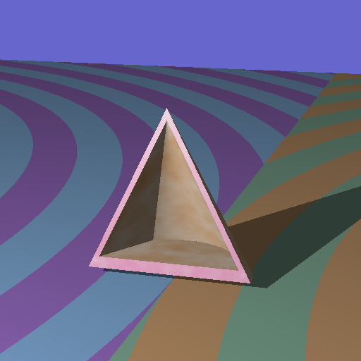

# SAILER 2026

A command-line ray tracer, originally written by **David Fletcher (1991–1993)** as
*SAIL/SAILER* — "Surface Attributes Interpreted Language". This repository
modernizes the original C sources to build with a current `clang`, replaces the
old lex/yacc scene-description parser with a **JSON** front-end, and adds
**PNG / JPEG** image output.



*(A CSG hollow pyramid — a box minus a cone, intersected with a cone — sitting on a
procedurally textured ground plane. Rendered from [`scenes/cone.json`](scenes/cone.json).)*

---

## Quick start

```sh
make                                  # builds ./ray
./ray scenes/cone.json -o cone.png    # renders a PNG
```

```
usage: ray <scene.json> [-o output.png] [-q quality] [-t threads]

  <scene.json>     JSON scene description (required)
  -o, --output F   output image; format chosen from the extension
                   (.png .jpg .jpeg .bmp .tga .ppm). default: <scene>.png
  -q, --quality N  JPEG quality 1..100 (default 90)
  -t, --threads N  render threads (default: all cores; 1 = serial)
  -h, --help       help
```

`make run` builds and renders the sample scene in one step.

### Performance

The renderer is **multithreaded** (pthreads, one render gives each thread a
private clone of the scene so it's lock-free) and uses a **BVH** spatial index
so `trace()` scales toward O(log N) in object count. On a 15-core Apple M5 Pro
the threading alone is ~10.7×; the BVH adds ~13× on a 400-object scene; together
a 400-sphere scene drops from ~4 s to ~30 ms. All optimizations produce
pixel-identical output. See [BENCHMARK.md](BENCHMARK.md) for the baseline,
methodology, and roadmap.

```sh
make release           # -O3 -ffast-math -flto -mcpu tuned build
make bench             # time the benchmark scene 5x
./ray scenes/benchmark.json -t 15
```

---

## What changed from the original

The original was a Mac/THINK-C project (`*.Cpp` / `*.H` files, a `MAKEFILE`,
and a hand-written **lex** (`LEX.L`) + **yacc** (`PARSER.Y`) grammar). The
pristine sources are preserved untouched in [`original/`](original/).

| Area | Original | Now |
|------|----------|-----|
| Scene parser | lex + yacc custom language | JSON ([`src/jsonscene.c`](src/jsonscene.c)) |
| Image output | PPM only (`writeppm.c`) | PNG/JPEG/BMP/TGA/PPM ([`src/image.c`](src/image.c)) |
| Entry point | hard-coded filename | CLI ([`src/main.c`](src/main.c)) |
| Build | THINK-C / `MAKEFILE` | [`Makefile`](Makefile) + clang |

### How the JSON port works

The original design was already two clean layers:

1. A **front-end** (lex/yacc) that parsed the scene text into a small parse
   tree of *assignments* (`lvalue = rvalue`) and called
   `NewSailModule(kind, name, assignments)`.
2. A **back-end** of `BuildXXX()` functions (one per primitive / surface
   module) that walked that parse tree and constructed the actual scene
   objects, which the ray-tracer kernel then renders.

The port **replaces only layer 1**. [`src/jsonscene.c`](src/jsonscene.c) parses
JSON (via the vendored [cJSON](third_party/cJSON.c)) and builds the *exact same*
`value_type` / `rvalue_type` / `assmt_type` structures the grammar used to build,
then calls the unchanged `NewSailModule`. Every module builder
(`conic.c`, `csg.c`, `paramap.c`, `range.c`, …) and the entire ray-tracer kernel
(`raymain.c`, `bound.c`, `csg.c`, …) are reused **without modification**.

The only engine-side change is a one-line robustness tweak in `CheckValue()`
([`src/sail.c`](src/sail.c)) that transparently coerces between integer and
double numbers, since JSON does not distinguish `1` from `1.0`.

---

## JSON scene format

A scene is either a JSON array of module objects, or an object with a `scene`
array (and optional `colortable`). Each module object has a `kind`, an optional
`name` (which makes it reusable by reference), and assignment keys.

```jsonc
{
  "scene": [
    {
      "kind": "view",
      "viewpoint": { "xyz": [10, 10, -35] },
      "gazedir":   { "xyz": [-0.1, -0.1, 0.35] },
      "updir":     { "xyz": [0, 1, 0] },
      "angle": 0.20, "ratio": 1.0, "width": 512, "height": 512
    },
    {
      "kind": "global",
      "ambient": { "rgb": [1, 1, 1] }, "ambcoef": 0.3,
      "lightsrc": { "xyz": [-12, 12, -30] },
      "lightcolor": { "rgb": [1, 1, 1] },
      "bkgrndsurface": { "kind": "attribute", "color": { "rgb": [0.4, 0.4, 0.8] } }
    },
    {
      "kind": "conic", "name": "myCone",
      "loc": { "xyz": [0, 3, -2] }, "axis": { "xyz": [3, 6, 3] },
      "rot": { "xyz": [0, 0, 0] }, "type": "cone",
      "diff": 1.0, "refl": 0.0,
      "surface": { "kind": "attribute", "color": { "rgb": [0.8, 0.5, 0.2] } }
    },
    { "kind": "csg", "operation": "-", "left": "box1", "right": "myCone" }
  ]
}
```

### Value encoding

| Old language | JSON |
|---|---|
| `xyz(1,2,3)` | `{ "xyz": [1, 2, 3] }` |
| `rgb(1,0,0)` | `{ "rgb": [1, 0, 0] }` |
| number / `0.5` | `5` / `0.5` |
| `surface = test2;` (reference) | `"surface": "test2"` |
| `operation = "-";` (string) | `"operation": "-"` |
| `flags = WIDEY,GLOBAL;` | `"flags": ["WIDEY", "GLOBAL"]` |
| `flags = WIDEALL;` | `"flags": "WIDEALL"` |
| nested module `axis = bbox { … };` | `"axis": { "kind": "bbox", … }` |
| assignment block `mapx = { type=FNOISE; };` | `"mapx": { "type": "FNOISE" }` |
| repeated `solid = {…}; solid = {…};` | `"solid": [ {…}, {…} ]` |

### Module kinds

`view`, `global`, `attribute`, `paramap`, `bbox`, `range`, `check`, `bitmap`,
`mandel`, `sphere`, `conic`, `box`, `board`, `triangle`, `csg`.

A named module (`"name": "foo"`) can be referenced elsewhere by its name string
(`"surface": "foo"`, `"left": "foo"`). CSG `operation` is `"+"` (union),
`"*"` (intersection), or `"-"` (difference).

---

## Project layout

```
sailer2026/
├── src/            modernized engine + new JSON loader / image writer / CLI
├── third_party/    cJSON, stb_image_write (vendored, public domain / MIT)
├── scenes/         JSON scene files
├── original/       pristine 1991–1993 sources (reference, untouched)
├── .vscode/        VS Code build/debug/IntelliSense config
└── Makefile
```

## Notes

- **Reproducibility of textures:** procedural `NOISE`/`FNOISE` surfaces seed a
  lattice with the C library's `rand()`, so noise-textured regions differ from
  the 1993 reference render even though geometry, CSG, and lighting are
  pixel-identical.
- **Toolchain:** builds with Apple `clang`; only `libm` is linked. No external
  libraries or package manager required.
